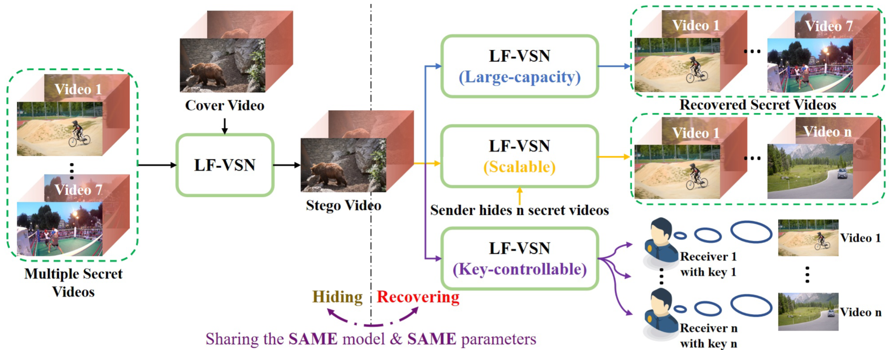

# Large-capacity and Flexible Video Steganography via Invertible Neural Network (CVPR 2023)
[Chong Mou](https://scholar.google.com.hk/citations?user=SYQoDk0AAAAJ&hl=en), Youmin Xu, Jiechong Song, [Chen Zhao](https://scholar.google.com/citations?hl=zh-CN&user=dUWdX5EAAAAJ), [Bernard Ghanem](https://www.bernardghanem.com/), [Jian Zhang](https://jianzhang.tech/)

Official implementation of **[Large-capacity and Flexible Video Steganography via Invertible Neural Network](https://arxiv.org/abs/2304.12300)**.

## **Introduction**
<p align="center">
  
</p>

<!-- <div align="center"> -->
Video steganography is the art of unobtrusively concealing secret data in a cover video and then recovering the secret data through a decoding protocol at the receiver end. Although several attempts have been made, most of them are limited to low-capacity and fixed steganography. To rectify these weaknesses, we propose a **L**arge-capacity and **F**lexible **V**ideo **S**teganography **N**etwork (**LF-VSN**) in this paper. For large-capacity, we present a reversible pipeline to perform multiple videos hiding and recovering through a single invertible neural network (INN). Our method can **hide/recover 7 secret videos in/from 1 cover video** with promising performance. For flexibility, we propose a key-controllable scheme, enabling different receivers to recover particular secret videos from the same cover video through specific keys. Moreover, we further improve the flexibility by proposing a scalable strategy in multiple videos hiding, which can hide variable numbers of secret videos in a cover video with a single model and a single training session. Extensive experiments demonstrate that with the significant improvement of the video steganography performance, our proposed LF-VSN has high security, large hiding capacity, and flexibility.

---

<!-- ## **🔥🔥🔥 Demo**
<p align="center">
  
</p> -->

## 🔧 **Dependencies and Installation**
- Python 3.6
- PyTorch >= 1.4.0
- numpy
- skimage
- cv2  

## ⏬ **Download Models**

The pre-trained models are available at:
<!-- <div align="center"> -->

| Mode       |         Download link                     | 
| :------------------- | :--------------------------------------------: |
| One video hiding        |       [Google Drive](https://drive.google.com/file/d/1aEMZaigkMd2NUNXnOu2r0oa5IuLPCtTh/view?usp=share_link)                     | 
| Two video hiding        |       [Google Drive](https://drive.google.com/file/d/1Yd7tK9Y-J4fkXoL-5u8VifEVsW7OmZN0/view?usp=share_link)                     | 
| Three video hiding        |       [Google Drive](https://drive.google.com/file/d/1oeDDzkYMZ6tKpPnIUwSI2v_Rbn7vLQJo/view?usp=share_link)                     | 
| Four video hiding        |       [Google Drive](https://drive.google.com/file/d/1kyMKdfAG_gq6ArWChv6ZMLBsqT-QpS9j/view?usp=share_link)                     | 
| Five video hiding        |       [Google Drive](https://drive.google.com/file/d/1OlTL6_ZgsThPeYfxbpGrGvNoaisqThq2/view?usp=share_link)                     | 
| Six video hiding        |       [Google Drive](https://drive.google.com/file/d/1dr-ZIL-VP0ol4fRO7bGZYQoxRetA-GXW/view?usp=share_link)                     | 
| Seven video hiding        |       [Google Drive](https://drive.google.com/file/d/178cqpz_vS-mPlYwLuZP2qFc7pV7vrXrr/view?usp=share_link)                     | 

## **Data Preparing**
Please download the training and evaluation dataset from [Vimeo-90K](http://toflow.csail.mit.edu/).

## **Train**

Training the desired model by changing the config file.

```bash
python train.py -opt options/train/train_LF-VSN_1video.yml
```

## **Test**

Testing the desired model by changing the config file.

```bash
python test.py -opt options/train/train_LF-VSN_1video.yml
```

## **Qualitative Results**
<p align="center">
  
</p>

## 🤗 **Acknowledgements**
This code is built on [MIM-VRN (PyTorch)](https://github.com/ding3820/MIMO-VRN). We thank the authors for sharing their codes of MIMO-VRN.

## :e-mail: Contact

If you have any question, please email `eechongm@gmail.com`.

## **Citation**

If you find our work helpful in your resarch or work, please cite the following paper.
```
@inproceedings{mou2023lfvsn,
  title={Large-capacity and Flexible Video Steganography via Invertible Neural Network},
  author={Chong Mou, Youmin Xu, Jiechong Song, Chen Zhao, Bernard Ghanem, Jian Zhang},
  booktitle={CVPR},
  year={2023}
}
```
